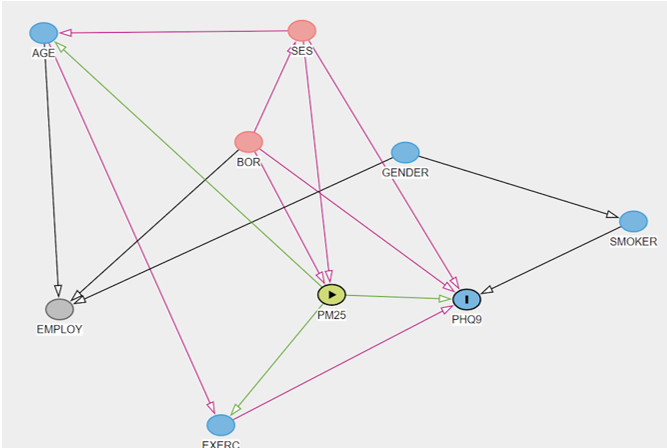
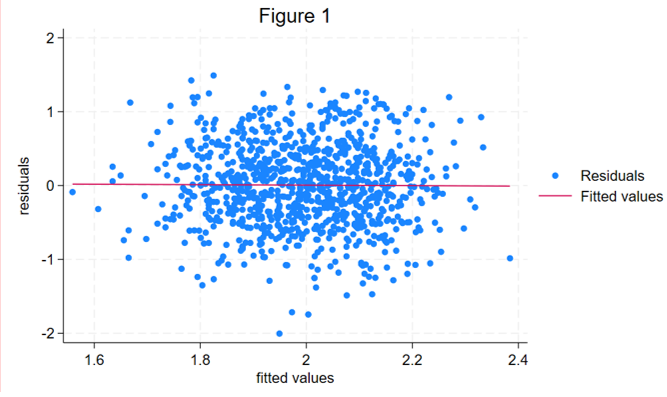
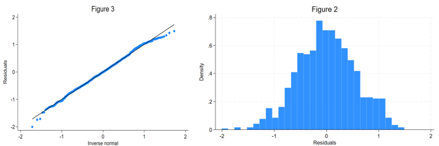
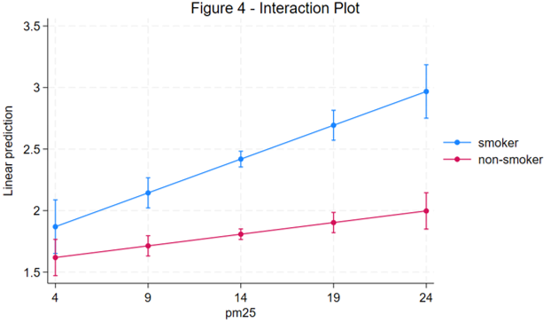

The study was a cross-sectional survey of 1834 adults aged 16 years and over residing in the 32 London boroughs between 2008 and 2010. The total population size for the 32 boroughs was 7,653,600 (mid-2009 estimate).
The dataset contains the following variables:

pid		Participant numeric identifier 
borough	Borough

age	Participant age at time of completing the survey 

ses	Socioeconomic measure of deprivation

1 = Least deprived; 5 = Most deprived. 

employment	Nature of work (Manual/Office)

gender	Gender (Female/Male)

exercise	How many times a week they exercise 

smoker	Smoking status (Smoker/Non-smoker)

pm25	Particulate matter with an aerodynamic diameter of <2.5 mm, annual average concentrations (mg/m3).

phq9	Depression symptom score

0 = No depressive symptoms; 27 = all depressive symptoms.

Depression affects around 1 in 6 adults in the UK (Champion Health UK, 2023). The severity of depression results in reduced quality of life, impaired day-to-day functioning and socioeconomic deterioration (Hammer-Helmich et al., 2018; Vos et al., 2015). Air pollution ranks among the top five risks for deaths all over the globe (Cohen et al., 2017). A recent systematic review and meta-analysis showed associations of PM2.5 and PM10 with depression, anxiety, psychosis, bipolar disorder and suicide in adults, with more than six months of exposure to pollutants causing severe depression (Braithwaite et. Al., 2019). Studies have suggested both direct and indirect causal links between air pollution and depression. Indirectly, exposure to air pollution can first result in increased risk of developing neurological and physical impairments, cumulatively leading to depression (Qiu et. al., 2023). Outdoor air pollution also limits the amount of time people spend outdoors, reducing physical activity and inducing social isolation, resulting in detrimental effects to mental health (Abu-Omar, 2004). Directly, mechanistic studies have shown that inhalation of air pollutants causes neuroinflammation and cerebrovascular damage (Babadjouni et al., 2017), resulting in onset of depression as a result of neurotransmitter dysregulation. 

In light of these studies, we are interested in studying the effects of air pollution on depression amongst individuals across 32 boroughs in London, UK. Past research has also indicated the effects of low socioeconomic status on increasing the likelihood of depression (Jespersen,2023). We will therefore adjust for socioeconomic status and boroughs while studying the link between air pollution and depression. Although research is scarce, there is also an indication of the combined effect of air pollution and smoking on depression in low and middle-income countries (Borroni, 2022). Our analysis will attempt to contribute to this literature by studying whether the effects of air pollution with mental health depend on smoking among individuals residing in these London boroughs.
The data was first cleaned by identifying all missing values, detecting and handling outliers. Further analyses were carried on a complete case dataset by removing missing values using listwise deletion. 

For section 3, the extent of missing data was first calculated. To study the effects of other variables on the probability of missingness, chi-square test for independence and t test were conducted. Former is considered an appropriate test for examining associations between missingness and categorical variables of the data whereas latter examined whether there was a significant difference between the group means of continuous variables with missing and non-missing information. Once the test provides an initial indication of a significant relationship between probability of missingness and a categorical variable, logistic regression analysis is conducted to determine if the variable predicts missingness in the dataset. 

For section 4, directed acyclic graph (DAG) is implemented based on a combination of evidence from past literature and assumptions about proposed causal relationships. As a visual representation tool, DAG helps in identifying potential confounders and colliders affecting the relationship between air pollution and depression scores. Since our data is hierarchical in nature (individuals nested within boroughs), a mixed-effects model is justified. Lastly, the model is statistically tested for violations of assumptions of linearity, independence of errors, normality of residuals and homoscedasticity. 
Section 5 involved testing the hypothesis that the association between air pollution and depression scores varies based on smoking status. The model used in section 4 is adapted here to include an interaction term between smoking status and pm25. Effect estimates, confidence intervals and p-values were reported that provided information on strength and significance between associations. 
All statistical analyses were performed using Stata 18.0.

Section 3: 
Depression scores phq9 has the most missing values (n=550). There are 870 participants for whom all the variables are observed. The most common missing data pattern is when all variables but phq9 are observed (n=389). The next most commonly occurring missing data pattern is when all variables but ses are observed (n=204). We can see that 53% of our sample is missing at least one variable.

When conducting a chi-square test to determine whether occurrence of missing values is independent of gender, the statistical evidence rejects the null hypothesis of independence (p=0.005), suggesting a statistically significant association between the two. However, this test does not confirm a causal relationship between the two. By running a logistic regression, it can be concluded that gender predicts missingness in the dataset (p=0.005) with the odds ratio suggesting the odds for females being in the excluded category is reduced by approximately 23.24% (i.e., 1 - 0.7676) compared to males. However, missingness was not found to be significantly associated with different levels of socioeconomic levels (p=0.198), employment (p=0.378), smoking(p=0.669), exercise (p=0.494) and borough (p=0.926). For continuous variables pm25 (air pollution) and phq9 (depression scores), a t-test was run to compare whether the mean levels of these variables' values significantly differed depending on whether the data was missing or not. The t-test for pm25 and phq9 both indicated that there is no significant difference between observations with missing values compared to observations without missing values (p value =0.6193 and p value=0.1872 respectively). These results suggest that pm25 and phq9 are not associated with probability of missingness in the data. Therefore, we can conclude that only gender predicts the probability of missing data being present or not. This implies that missingness in the data is at least not completely at random. The above tests’ results also indicate that apart from gender, the distributions of other variables do not significantly differ despite missingness. 
	
Table 1. Descriptive Statistics for the study population
Summary 
N	1,834

phq9	8.720 (5.654) 7.000

pm25	14.037 (3.031) 14.100

age	35.665 (7.026) 35.000

_gender	

0	889 (48.8%)

1	931 (51.2%)

_smoker	

0	554 (30.2%)

1	1,280 (69.8%)

_employment	

0	1,381 (80.2%)

1	341 (19.8%)

SES	

1	318 (21.5%)

2	304 (20.6%)

3	269 (18.2%)

4	310 (21.0%)

5	277 (18.7%)

exercise	

0	308 (17.5%)

1	528 (30.1%)

2	458 (26.1%)

3	271 (15.4%)

4	139 (7.9%)

5	39 (2.2%)

6	9 (0.5%)

7	3 (0.2%)

8	1 (0.1%)
	

As can be seen in Table 1, the average age of participants in this dataset was approximately 35.67 years with a standard deviation of 7.03. Gender distribution showed 48.85% male and 51.15% female population. Socioeconomic status levels were diverse, with 21.52% being least deprived and 19.87% being most deprived. 80.2% of the sample worked in the office whereas 19.8% were involved in manual labour. Majority exercised a day a week (30.07%) followed by twice a week (26.08%). and no exercise at all (17.54%). 69.79% of the sample did not smoke, compared to 30.21% smokers. Regarding boroughs (Table 2), 3.76% of the sample belonged to Hounslow followed by Croydon (3.65%). The average depression scores were approximately 8.72 with a standard deviation of 5.65. The distribution of depression scores indicates a right skewness (i.e., mean (8.72) > median (7.00). Therefore, we log transform this distribution to get a mean depression score of 1.92 with a standard deviation of 0.62 and median score of 1.95. The average air pollution levels pm25 were approximately 14.04 with a standard deviation of 3.03.   

My rationale for the specified DAG is a mixture of evidence from past literature and my assumptions regarding the proposed causal relationship based on my understanding of the concepts/variables:
It is likely that one’s age causally determines the kind of employment one is suitable for (i.e., manual vs employed) as well as one’s ability to exercise a certain number of times a week. Therefore:
- AGE -> EMPLOYMENT
- AGE -> EXERCISE

We will also assume that the borough one lives in can predict the type of employment, depression levels, air pollution levels, and socioeconomic status of that individual. These variables could be affected by the policies shaped by the borough’s governing body as well as regional and geographical effects. Therefore:
- BOROUGH -> EMPLOYMENT
- BOROUGH -> PHQ9
- BOROUGH -> PM25
- BOROUGH -> SES
Experimental studies have suggested a causal relationship between exercise and depression, estimating a 26% decrease in odds for becoming depressed for a unit increase in objectively measured physical activity (Choi et al., 2019). Therefore:
- EXERCISE -> PHQ9
Another paper (Chinwong et al., 2018) showed higher smoking behaviours among males than females. I will also assume that males are more likely to be involved in manual labour compared to females. Therefore:
- GENDER -> EMPLOYMENT
- GENDER -> SMOKER
A recent paper’s findings suggest that a reduction in sulphur dioxide concentrations results in a 0.9% and 1.5% decrease in cardiovascular deaths for people aged 60 and children under the age of 5, respectively (Fan et al., 2023). Therefore:
- PM25 -> AGE
Some studies suggest that high air pollution episodes may prevent people from engaging in physical activity overall. Air pollution decreases lung function and elevates blood pressure, resulting in impaired exercise capacities (Cutrufello et al., 2011). Second, visible air pollution can discourage people from engaging in physical activities outdoors (Roberts et al., 2014). Therefore:
- PM25 -> EXERCISE
As discussed in section A, past literature has indicated a significant causal link between air pollution and depression scores. Therefore:
- PM25 -> PHQ9

On the other hand, Stringhini et al. (2017)’s paper highlights a causal relationship between socioeconomic status and mortality, with participants with a lower socioeconomic status having greater mortality compared to those with high socioeconomic status. Most North American studies have shown that areas where lower socioeconomic status residents reside experience higher concentrations of air pollutants; however, European research has been mixed so far (Hajat et al., 2015). Although the relationship between SES and depression scores can be bidirectional (i.e., depression can drive an individual to poverty as well as poverty can drive an individual to depression), I would assume the latter for my proposed DAG. Given the current socioeconomic circumstances presently in Britain with a cost-of-living crisis through the roof (Economic Times, 2023), one’s socioeconomic status is more likely to predict their depression scores.
- SES -> AGE
- SES -> PHQ9
- SES -> PM25
Smokers have approximately 60% increased odds of developing depression compared to non-smokers (Luger et al., 2014).
- SMOKER -> PHQ9

According to the DAG proposed above, the minimal sufficient adjustment sets for estimating the total effect of PM25 on PHQ9 are {BOR, SES}.

Considering socioeconomic status to be a fixed effect across boroughs and boroughs themselves to be random effects, we run a mixed-effects model. The estimated coefficient for pm25 is approximately 0.030 (95% CI [0.018, 0.043]). This implies that for every unit increase in pm25 levels, the phq9 scores increase by approximately 0.030 units, holding other variables constant. Compared to reference category 1 (ses - least deprived), the estimated coefficient for ses level 2 is 0.106 (95% CI [-0.012, 0.225], p=0.079), ses level 3 is approximately 0.172 (95% CI [0.051, 0.293], p<0.001), ses level 4 is approximately 0.223 (95% CI [0.107, 0.340], p<0.001), and ses level 5 is approximately 0.263 (95% CI [0.139, 0.388], p<0.001). Considering all predictors to be zero, the estimated phq9 score is approximately 1.423 (95% CI [1.215, 1.631], p<0.001). Therefore, pm25 and ses levels 3, 4, 5 show statistically significant associations with phq9 scores. Higher ses levels are significantly associated with higher depression scores. We are considering the effect of boroughs to be random. The estimated variance of the intercept between boroughs is 0.039 (95% CI [0.021, 0.075]). This indicates that there is some variability in phq9 scores between boroughs that is unexplained by the fixed effects in our model. Whereas, residual variance estimates the variability of phq9 scores within boroughs after conditioning on fixed effects. It is currently estimated at 0.318 (95% CI [0.289, 0.350]). The likelihood ratio test suggests that the mixed-effects model significantly fits the data better than a linear model (chibar2(01)=53.21, p<0.001).

The assumptions for linear mixed effects model are: 
1.	Explanatory variables must be related linearly to the response variable: This assumption holds true as can be seen in Section 4 Figure 1, i.e., the residuals have a mean of zero for every value of the fitted values. This can indicate that other relevant variables and interactions are included in our model.
2.	Independence of errors: There is no correlation between residuals and fitted values as can be seen in Section 4 Figure 1. Therefore, this assumption holds true. 

3.	The residuals are normally distributed: We run a histogram of residuals followed by the quantile of normal distribution (Section 4, Figure 2). The histogram is approximately normally distributed. The residuals follow an approximately linear trend in the qnorm plot, indicating that the residuals are normally distributed (Section 4, Figure 3). 
4.	Homoscedasticity: the spread of the residuals across the fitted values do not vary with a discernible pattern, suggesting homoscedasticity (figure 1). 

Some past studies have suggested that effects of air pollution with mental health depend on smoking. Specifically, there is evidence that the association of air pollution with depressive symptoms is stronger among current smokers compared to non-smokers. Hereby I test this hypothesis:
For non-smokers, the coefficient for pm25 is approximately 0.021 (95% CI [0.008, 0.034], p=0.002), suggesting that for every unit increase in pm25, the logarithm of depression scores increases by approximately 0.021 units. Across different SES categories, substantial significance is observed only for categories 4 (95% CI [0.102, 0.340], p<0.001) and 5 (95% CI [0.120, 0.376], p<0.001), indicating that higher SES levels are associated with higher depression scores. Across boroughs, the estimated variance is approximately 0.036, indicating variability in depression scores across boroughs.

For smokers, the coefficient for pm25 is approximately 0.046 (95% CI [0.027, 0.066], p<0.001), suggesting that for every unit increase in pm25, the logarithm of depression scores increases by approximately 0.046 units. Across different SES categories, substantial significance is observed only for categories 3 (95% CI [0.164, 0.549], p<0.001), 4 (95% CI [0.102, 0.340], p<0.001), and 5 (95% CI [0.120, 0.376], p<0.001) when compared to reference category 1, indicating that higher SES levels are associated with higher depression scores. Across boroughs, the estimated variance is approximately 0.056, indicating variability in depression scores across boroughs.
Both groups show significant associations between depression scores and air pollution levels, with potentially stronger associations amongst smokers. The plot below (Figure 4) indicates that effect modification is present since the lines are not parallel. The tests results indicate the additional effect of the interaction between smoking and pollution. For every unit-increase in pm25, the effect on log of depression scores is reduced by approx. 0.036 units for non-smokers compared to smokers (95% CI [-0.061, -0.011], p=0.005). 
 

The missingness analysis that I proposed was unable to conclusively determine whether the missing data mechanism was MCAR (missing completely at random), MAR (missing at random), or MNAR (missing not at random). According to the analysis, gender predicted missingness; therefore, it can be implied that missingness might not be MCAR. However, the mixed-effects model I ran assumed MCAR. Secondly, using listwise deletion instead of other techniques, such as multiple imputation, led to the loss of potentially valuable information considering 53% of our sample was missing, therefore, diminishing statistical power. Considering that MCAR may be violated, biased results may have also arisen. Moreover, my analysis did not reflect the influence of other observed and unobserved confounders on the outcome variable, depression scores. Moreover, the analysis did not take into account indirect effects. There could be mediators present such as health ailments that are the result of air pollution and a subsequent cause of depression. Studying these indirect effects of air pollution on depression could help improve the validity of our causal claims. Moreover, most assumptions I proposed for the directed acyclic graphs might not capture the true causal structure. Lastly, my analysis failed to assess level 2 residuals, compromising the reliability of my model’s inferences. 
As for strengths, applying a log transformation to depression scores helped normalize their positive skewness, stabilize variance, and reduce the impact of outliers. Moreover, due to the sufficiently large categories of the ordinal categorical variable phq9, I treated it as a continuous variable to simplify the analysis. Thirdly, our analysis tested whether statistical assumptions for the mixed-effects model. The keys assumptions of normality for residuals, independence of errors, homoscedasticity and linearity were not violated, indicating a reliable and adequate model. Visualizing causal relationships using a directed acyclic graph helped make my implicit assumptions about causal relationships between independent variables explicit, aiding in confounder and collider identification while promoting transparency in the proposed research design.

Bibliography

Choi, K. W., Chen, C.-Y., Stein, M. B., Klimentidis, Y. C., Wang, M.-J., Koenen, K. C., & Smoller, J. W. (2019). Assessment of Bidirectional Relationships Between Physical Activity and Depression Among Adults. JAMA Psychiatry, 76(4), 399. https://doi.org/10.1001/jamapsychiatry.2018.4175

Ali, N. A., & Khoja, A. (2019). Growing Evidence for the Impact of Air Pollution on 
Depression. Ochsner journal, 19(1), 4. https://doi.org/10.31486/toj.19.0011

Luger, T. M., Suls, J., & Vander Weg, M. W. (2014). How robust is the association between smoking and depression in adults? A meta-analysis using linear mixed-effects models. Addictive Behaviors, 39(10), 1418–1429. https://doi.org/10.1016/j.addbeh.2014.05.011

There is a causal link between depression and socio-economic status: Study. (2022, December 13). The Economic Times. https://economictimes.indiatimes.com/magazines/panache/there-is-a-causal-link-between-depression-and-socio-economic-status-study/articleshow/96202524.cms?from=mdr

Borroni, E., Pesatori, A. C., Bollati, V., Buoli, M., & Carugno, M. (2022). Air pollution exposure and depression: A comprehensive updated systematic review and meta-analysis. Environmental Pollution, 292, 118245. https://doi.org/10.1016/j.envpol.2021.118245

Hammer-Helmich, L., Haro, J. M., Jönsson, B., Tanguy Melac, A., Di Nicola, S., Chollet, J., Milea, D., Rive, B., & Saragoussi, D. (2018). Functional impairment in patients with major depressive disorder: the 2-year PERFORM study. Neuropsychiatric Disease and Treatment, Volume 14, 239–249. https://doi.org/10.2147/ndt.s146098

Cohen, A. J., Brauer, M., Burnett, R., Anderson, H. R., Frostad, J., Estep, K., Balakrishnan, K., Brunekreef, B., Dandona, L., Dandona, R., Feigin, V., Freedman, G., Hubbell, B., Jobling, A., Kan, H., Knibbs, L., Liu, Y., Martin, R., Morawska, L., & Pope, C. A. (2017). Estimates and 25-year trends of the global burden of disease attributable to ambient air pollution: an analysis of data from the Global Burden of Diseases Study 2015. The Lancet, 389(10082), 1907–1918. https://doi.org/10.1016/s0140-6736(17)30505-6

Braithwaite, I., Zhang, S., Kirkbride, J. B., Osborn, D. P. J., & Hayes, J. F. (2019). Air Pollution (Particulate Matter) Exposure and Associations with Depression, Anxiety, Bipolar, Psychosis and Suicide Risk: A Systematic Review and Meta-Analysis. Environmental Health Perspectives, 127(12), 126002. https://doi.org/10.1289/ehp4595

Abu-Omar, K., Rütten, A., & Lehtinen, V. (2004). Mental health and physical activity in the European Union. Sozial- Und Praventivmedizin, 49(5), 301–309. https://doi.org/10.1007/s00038-004-3109-8

Babadjouni, R. M., Hodis, D. M., Radwanski, R., Durazo, R., Patel, A., Liu, Q., & Mack, W. J. (2017). Clinical Effects of Air Pollution on the Central Nervous System; A Review. Journal of Clinical Neuroscience : Official Journal of the Neurosurgical Society of Australasia, 43, 16–24. https://doi.org/10.1016/j.jocn.2017.04.028

Astrid Pernille Jespersen, Madden, R. A., Whalley, H., Reynolds, R. M., Lawrie, S. M., McIntosh, A. M., & Iveson, M. H. (2023). Socioeconomic Status and Depression - A Systematic Review. MedRxiv (Cold Spring Harbor Laboratory). https://doi.org/10.1101/2023.12.04.23299380

